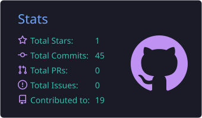
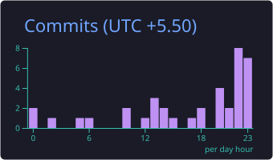
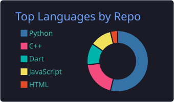
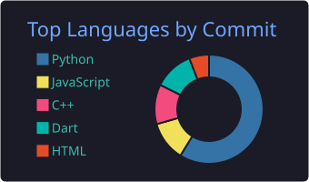

<div align="center">

# 👋 Hi, I'm Aditya Kesarwani

### 🚀 AI/ML Developer | Software Developer | GenAI Enthusiast


</div>

---

## 🧑‍💻 About Me

🚀 I'm a developer who turns ideas into code.

🌱 Exploring **Generative AI, Agentic AI, Machine Learning & Full-Stack Development**

🎓 Computer Science Engineering student passionate about building real-world applications.

💡 I enjoy working with AI systems, mobile applications, backend development and intelligent automation.

🧠 Currently exploring **LLMs, RAG, AI Agents, LangChain, LangGraph & MCP**

🌍 Exploring the world through technology.

---

## ⚡ What I'm Working On

- 🤖 Generative AI & Agentic AI
- 🧠 Retrieval Augmented Generation (RAG)
- 🔎 LLM Evaluation & AI Agents
- 📱 Flutter Mobile Applications
- 🐍 Machine Learning & Computer Vision
- ⚙️ Backend APIs & Full-Stack Systems
- 🚀 Open Source Projects

---

## 🛠️ Tech Stack & Tools

<p align="center">


</p>

---

## 🤖 AI / ML

<p align="center">


</p>

---

## 🚀 Featured Projects

<table>
<tr>

<td width="50%">

### 🤖 AdiGPT
AI-based conversational project exploring intelligent interaction.

</td>

<td width="50%">

### 📱 Food Delivery App
Flutter-based mobile application with modern UI and application architecture.

</td>

</tr>

<tr>

<td width="50%">

### 👁️ Computer Vision
Projects involving object detection, face recognition and ML models.

</td>

<td width="50%">

### 📰 AdiNews
Python-based news application/project.

</td>

</tr>
</table>

---

## 📊 GitHub Stats

<p align="center">





</p>
---

## 🔥 Contribution Streak 

<p align="center">


</p>

---

## 📈 Contribution Graph

<p align="center">





</p>
---

## 🐍 Contribution Snake

<p align="center">

<picture>
  <source
    media="(prefers-color-scheme: dark)"
    srcset="https://raw.githubusercontent.com/adityakes11/adityakes11/output/github-contribution-grid-snake-dark.svg"
  />

  <source
    media="(prefers-color-scheme: light)"
    srcset="https://raw.githubusercontent.com/adityakes11/adityakes11/output/github-contribution-grid-snake.svg"
  />

  

</picture>

</p>

## 💡 Currently Learning

```text
Generative AI
      ↓
LLMs → RAG → Agents → MCP
      ↓
LangChain → LangGraph → AI Applications
